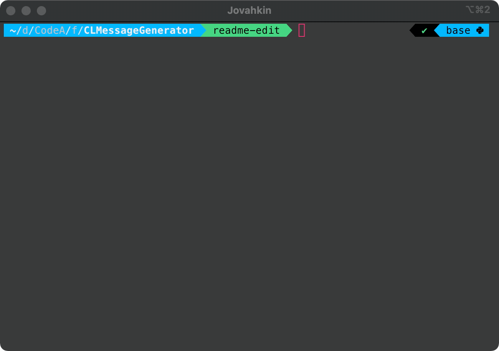

# CLMessageGenerator

## Introduction

Generates a random message in the terminal using a naive implementation with Node.js

---

## Dependencies

- csvToJson - <https://github.com/iuccio/CSVtoJSON>

---

## Setup

To install dependencies, clone this repo and run `npm install` in the root directory.

This implementation depends on *'quotes.csv'* being located in the same directory as *'index.js'*

---

## Usage

Once you have completed setup invoke the program with: `node index.js`
